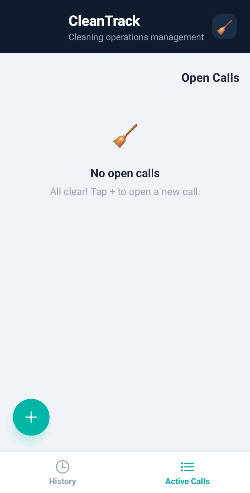
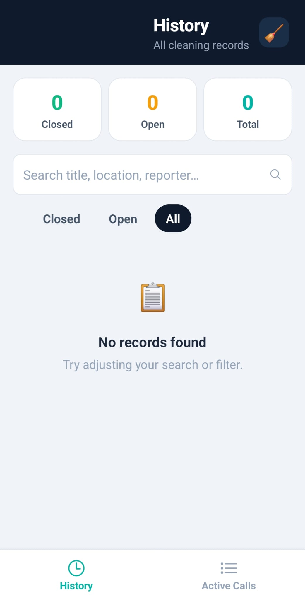
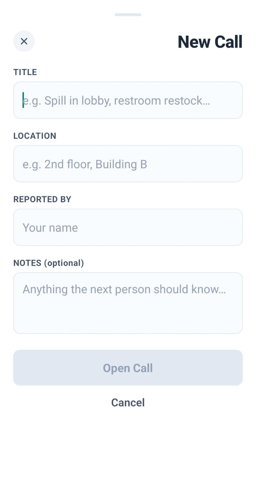

# CleanTrack

A mobile call-management app for a cleaning company: any staff member can open a job ticket, and it can only be closed after a photo is uploaded as proof of completed work.

Built with **React Native + Expo**.

---

## Setup

```bash
npm install
npx expo start
```

- **iOS:** open the Camera app and scan the QR code shown in the terminal
- **Android:** open the **Expo Go** app and tap "Scan QR code"

## Features

| Feature | Description |
|---|---|
| **Open a Call** | Tap **+** to log a cleaning job with title, location, reporter, and notes |
| **Close a Call** | Requires a photo taken on the spot — the confirm button is locked until a photo is attached |
| **Active Tab** | Shows all open calls, plus recently closed ones |
| **History Tab** | Full scrollable table of all calls, with search and status filters |
| **Photo Lightbox** | Tap any documentation photo to view it full-screen |
| **Persistent Storage** | All data is saved locally on the device via AsyncStorage |

## Project Structure

```
CleanTrack/
├── App.js                          # Root with tab navigation
├── app.json                        # Expo config + permissions
├── package.json
└── src/
    ├── screens/
    │   ├── ActiveCallsScreen.js     # Open/closed calls + FAB
    │   └── HistoryScreen.js         # Table view + filters
    ├── components/
    │   ├── CallCard.js              # Individual call card
    │   ├── NewCallModal.js          # Open a new call
    │   ├── CloseCallModal.js        # Close with photo proof
    │   └── UI.js                    # Shared components (buttons, pills, stats)
    └── utils/
        ├── storage.js               # AsyncStorage + helpers
        └── theme.js                 # Colors, spacing, typography
```

## Publishing to app stores

```bash
npm install -g eas-cli
eas login
eas build --platform all
```

## 📸 Screenshots

| Active calls | History | create a call |
|---|---|---|
|  |  |  |

